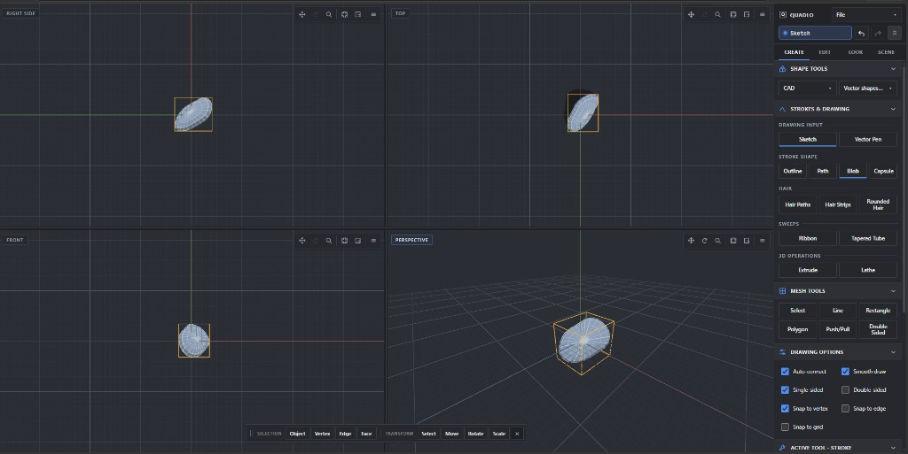
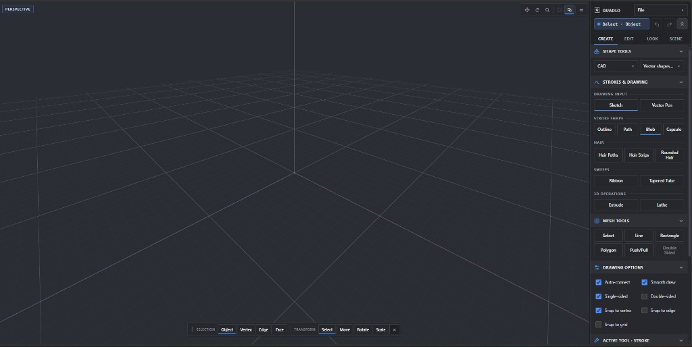
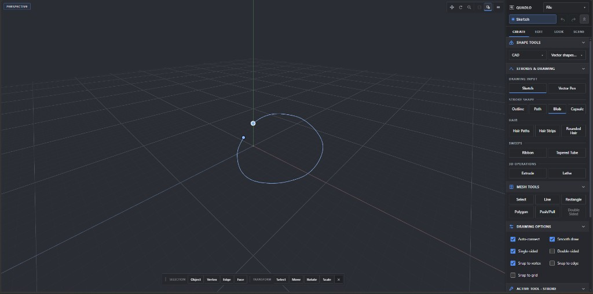
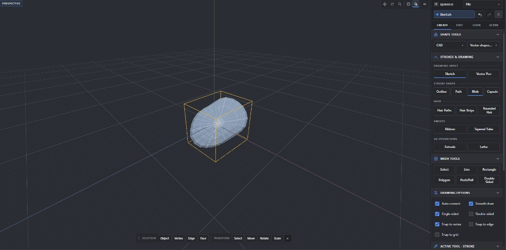
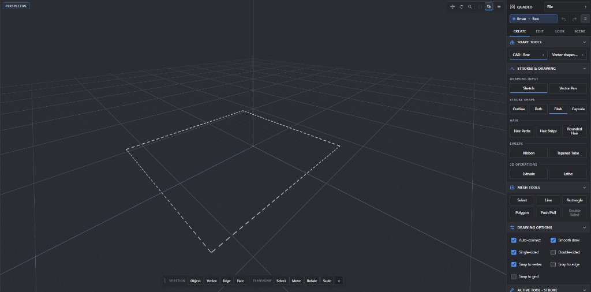
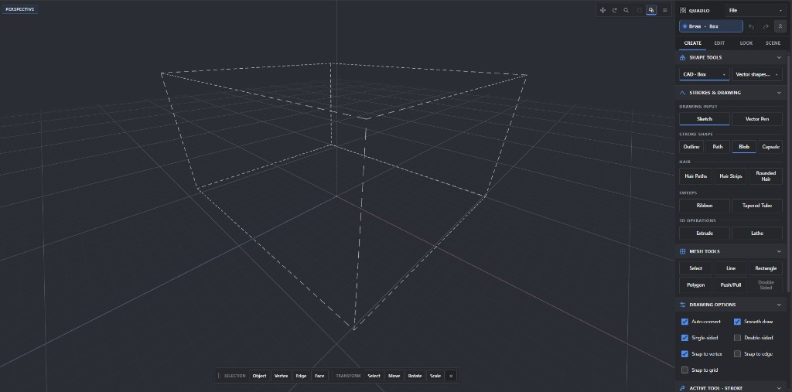
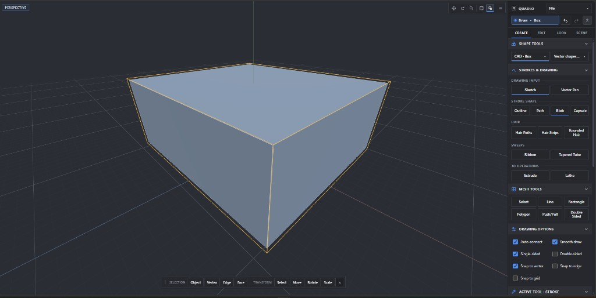

# Quadlo

Quadlo is a Windows desktop 3D modelling and pixel-art application built with React, Three.js, Zustand, Go, and Wails.



*Quad view with lighting and shadows*

## Screenshots

Create and sketch tooling:



*Empty workspace with sketch and create tools*



*Sketch stroke drawn in the viewport*



*Organic blob mesh generated from a sketch*

CAD box workflow:



*CAD box draft with dashed preview*



*CAD box in wireframe*



*CAD box solid with selection*

## Prerequisites

- Node.js 22
- Go 1.22 or newer
- Python 3.12 with `requirements-build.txt`
- Wails CLI 2.12.0
- Microsoft Edge WebView2 Runtime

## Development

```powershell
npm ci
npm run dev
```

Run the desktop shell with `npm run app:dev`.

## Verification

```powershell
npm run typecheck
npm test
npm run validate:primitives
npm run build
go test ./...
```

The history and viewport microbenchmarks are available through `npm run benchmark:history` and `npm run benchmark:viewport`.

## Windows package

```powershell
python -m pip install -r requirements-build.txt
go install github.com/wailsapp/wails/v2/cmd/wails@v2.12.0
npm run app:build
```

The executable is written to `build/bin/Quadlo.exe`.

See `docs/ARCHITECTURE.md`, `docs/PRODUCTION_AUDIT.md`, `docs/PERFORMANCE_BASELINE.md`, and `docs/RELEASE_CHECKLIST.md` for engineering and release guidance.
